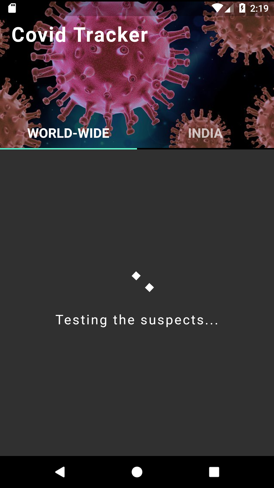
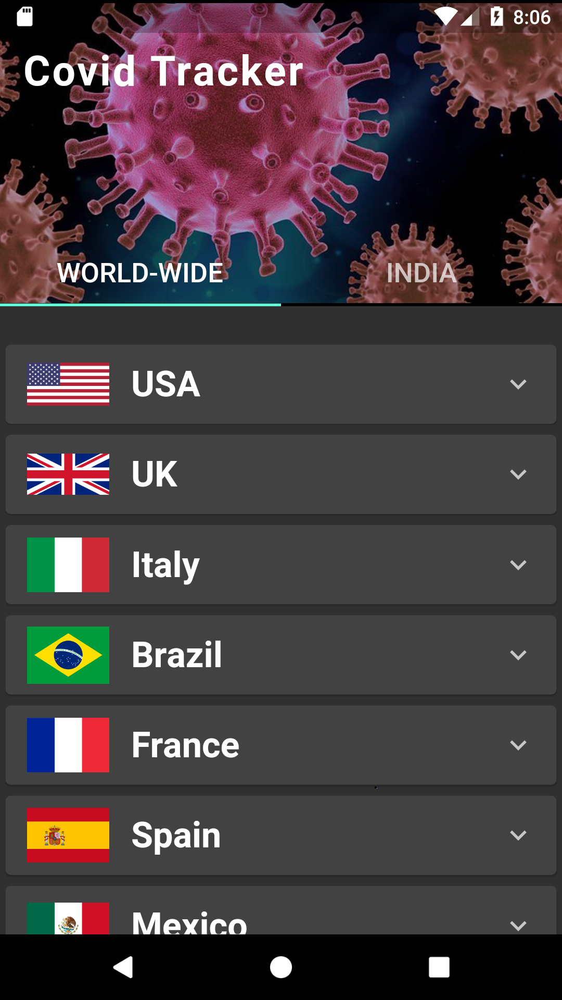
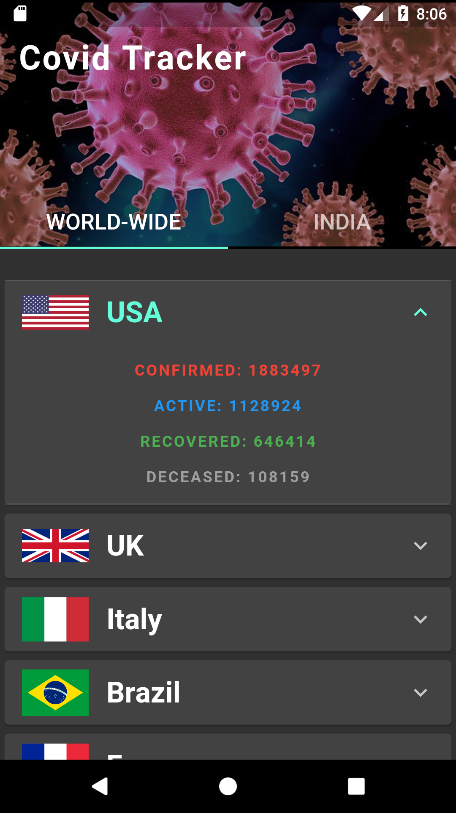
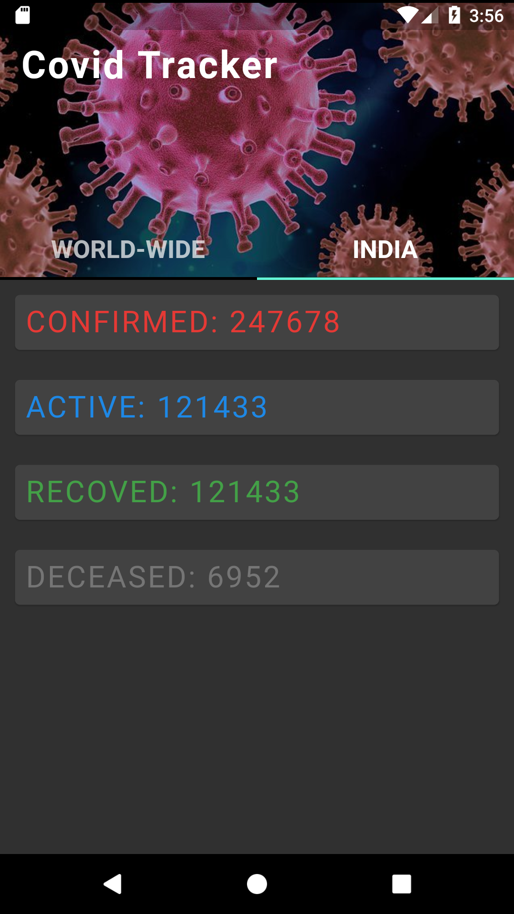

> # COVID-19 TRACKER

An intiative to make open-sourced Mobile Apllication to track Covid-19 cases all over the world with dedicated panel for India's demography.
The Application is implementation of cross-platform app-development framework Google Flutter.
It contain crisp UI with full API integration.

> Open-Source API:
The API is maintained by https://github.com/NovelCOVID/API .
  
> API-Link : https://corona.lmao.ninja/

> ## Screenshots of the product.

> ### Parsing data using REST API 

> ### World-wide Dasboard

> ### Expanded Country-wise Demography

> ### India Demography

